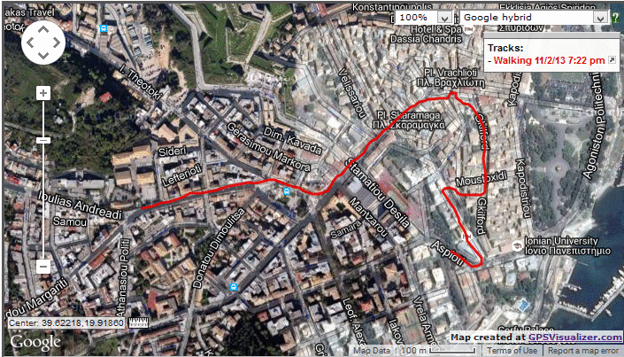
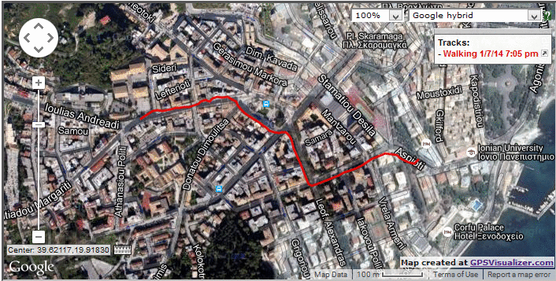

Clean gpx api
====

This api is a project created for the course "Ubiquitous Computing" of Computer Science department at Ionian University.
It uses google maps roads api to find which routes the person has taken inside the city of Corfu.

### Setup

To setup the api server you need to install the following programs:
- Redis (and start the database)
- Node.js
- Miniscript (from npm)

And then run
```bash
$ mini -r api
```

If you don't prefer the miniscript commands/language, compile the `.mini` files and then run:
```bash
$ node api
```

### Usage

Follow the below steps to use the already running api:

- Send a GET message containing your credencials at `host:port/access`
- The server will respond with a message containing the following data:
```js
{
	"token_type" : "Bearer",
	"access_token" : token::string,
	"expires_mins" : expire_time::number
}
```
- Now send a POST message to `host:port/clean` with your gpx file and token in the following form:
```js
{
	"gpx" : file::string //Strings with over a million characters are ignored
}
```
- The server will respond with a string containing the contents of the cleaned gpx file.
- Save the string into a `result.gpx` file and you are done.
- Resend your credentials at `/access` to refresh your token when it is about to expire or later.

### How

The api to clean a gpx file executes the following steps:

- **Keep any points close the median speed of the person**

This process excludes stationary points and points that have ridiculous speed, which is often a result of a gps error

- **Take 3/4 of the track's points with the highest curves, calculate new angles, repeat**

This process excludes intermediate points of an almost straight line. It tries to keep useful information which is found in turns.
This task is terminated when the path is reduced to 100 points or less, which is the max number of waypoints the google map api can handle.

- **Compare google map path result with the reduced path and replace points**

This task calculates the minimum distance between points of google maps result and the given gpx track. If the distance is not great enough, store concecutive points of google maps result in the result gpx. If the distance is above X meters, then check if that threshold is violated for a number of points. If the number of points is enough along with the length of that part of the path, then store the points of the given gpx track until the track meets with the google maps track. Repeat until the end of the gpx path.

- **Return the modified google roads api path**

### Results




## Future Improvements

1. In many cases boundaries to detect "noise" have constant values, which may not have a great result in various gpx tracks. These values should vary with the nature of the gpx track.
2. The result file does not preserve the right time for the intermediate points. Also as seen some metadata are not stored on the result.
3. The means calculated are arithmetic and they are greatly affected by noise values. Harmonic mean may be more suitable.
4. The original path compress function is not sophisticated enough to ignore noise turns, and thus some essential points are ignored (it can be seen on the first gif).
5. The api could be extended to store statistic data for fine-tuning.
6. Some more strict policies on account creation should be introduced to avoid DOS attacks and improve security, such as e-mails as usernames and more strict password requirements.
